# Save-the-Prince

Save the Prince is pixel game that takes inspiration from the eraly era of video games using pixelated grpahics, tongue-in-cheek dialogue and simple game design that all together gives the user a hit of nostalgia of when games were simpler while also not being particularly mechanically complex.

The game si set out with a classic 'Start Game' screen much like you see on an arcade, with a very simple story and the only player input being naming the knight who goes on this mini adventure. It utilises loading screens to add to the game feel and create a sense of journey for the knight as they explore. The hub of the game, the Grasslands, acts as choice for players to play either of the two games and add an explanation of what the knight is doing. From the hub, they can choose Challenge 1 or Challenge 2. Challenge 1 is set in a minotaur's lava domain and is a memory challenge where the player has to copy the patern, and the JavaScript code acts as a random number generator to give the player new paterns each time they play this game. Challenge 2 is set in the necromancer's castle, and requires the player to guess the connections between words. While the connections are set, the order they appear and where the words appear are set to random to give the player a unique experience each time. Each game gives a key, and once the player has both keys, they can go to the prison area and save the prince. This the final screen where you win the game and have the option of completely resetting the game and replaying it.

Visit the deployed website [here](https://greggy1234.github.io/Save-the-Prince/)

## Table of Contents

1. [UX & Design](#ux--design)
    1. [Website Objectives](#website-objectives)
    2. [User Stories](#user-stories)
    3. [Typography](#typography)
    4. [Colour Scheme](#colour-scheme)
    5. [Wireframes](#wireframes)
2. [Features](#features)
    1. [General](#general)
    2. [Intro Page](#intro-page)
    3. [Front Page](#front-page)
    4. [Loading Page](#loading-page)
    5. [Hub Area](#hub-area)
    6. [Game Areas](#game-areas)
    7. [Final Page](#final-page)
    8. [Future Features & Pages](#future-features--pages)
3. [Technologies Used](#technologies-used)
    1. [Languages](#languages)
    2. [Frameworks & Libraries](#frameworks--libraries)
    3. [Other Programs](#other-programs)
4. [Testing](#testing)
    1. [Code Validation](#code-validation)
    2. [User Story Testing](#user-story-testing)
    3. [Common Element Testing](#common-elements-testing)
    4. [Lighthouse Testing](#lighthouse-testing)
    5. [Browser & Device Testing](#browser--device-testing)
5. [Final Website](#final-website)
6. [Deployment](#deployment)
7. [Development Lifecycle](#development-lifecycle)
8. [Credits](#credits)
    1. [Content](#content)
    2. [Media](#media)
    3. [Code](#code)

***

## UX & Design

### Website Objectives

### User Stories

### Typography

### Colour Scheme

### Wireframes
[Balsamiq](https://balsamiq.com/) was the app used to create the wireframes. As the game is heavily based on JavaAcript changing the DOM, these are basic layouts which get more complex due to the code behind them.

As it is a game with a fixed viewing are for screen size tablet and above, the desktop/tablet layout are the exact same, so they will be grouped together in the table below.

Page | Desktop/Tablet Version | Mobile Version
--- | --- | ---
Intro Page | 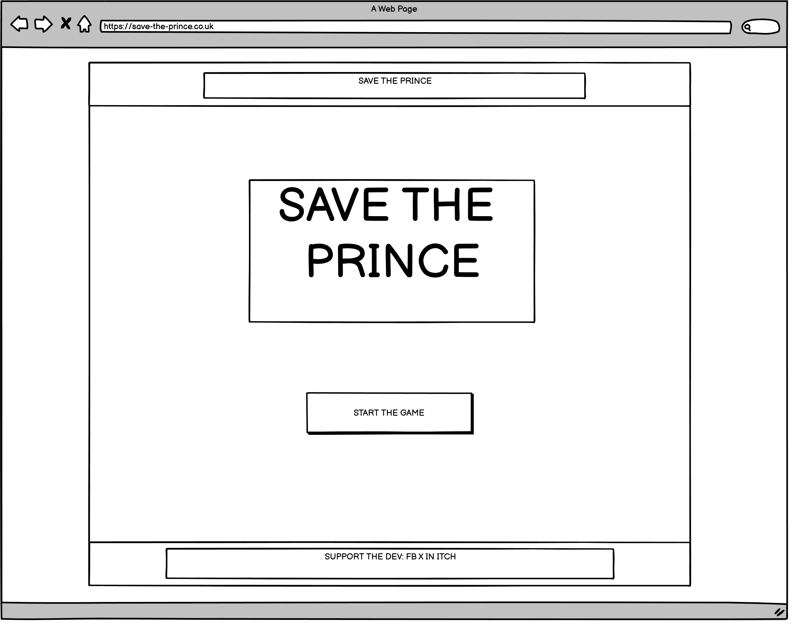 | 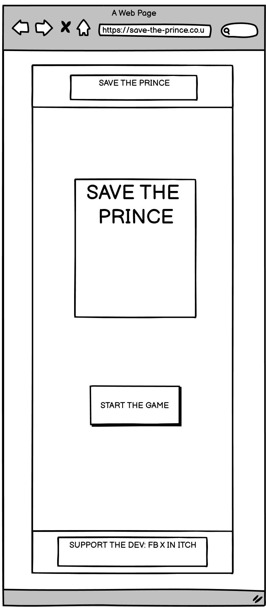
Front Page | 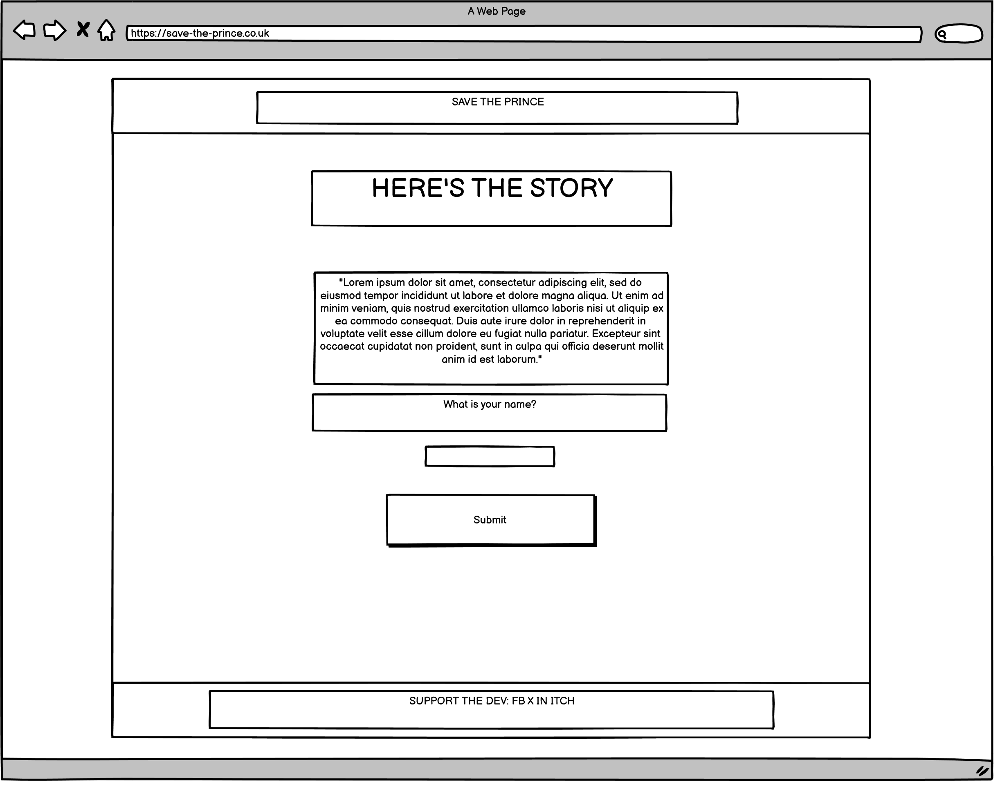 | 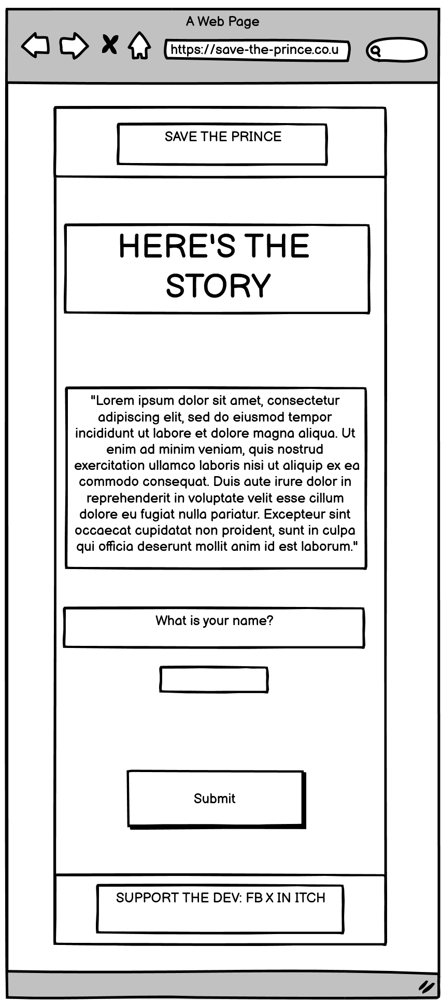
Loading Page | 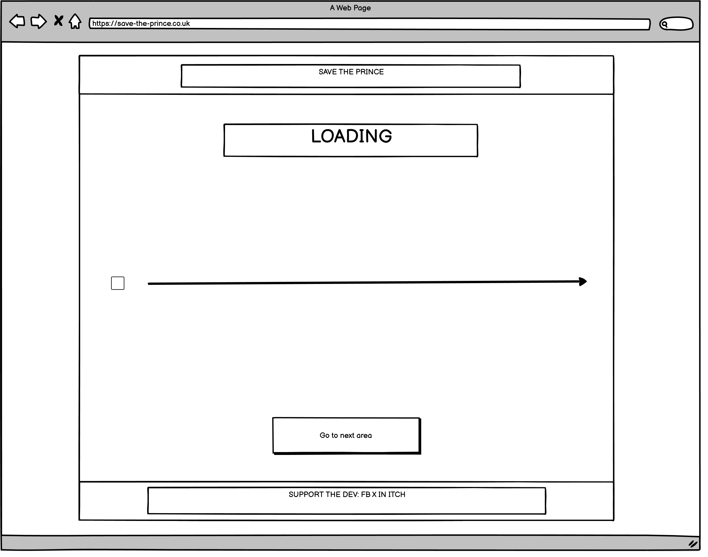 | 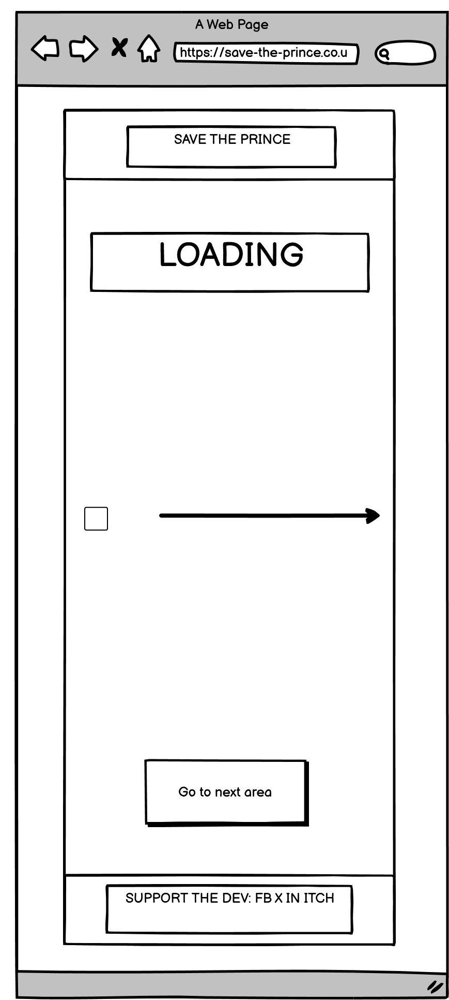
Hub Area | 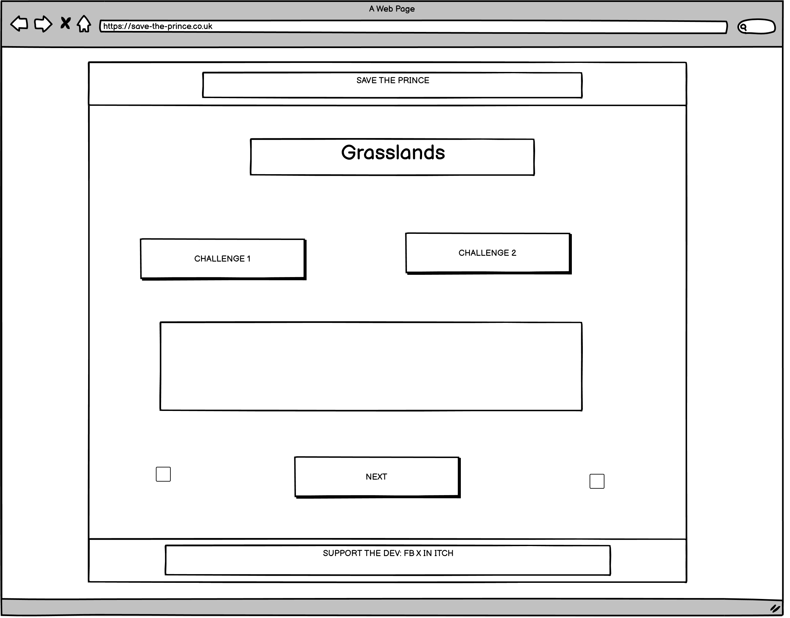 | 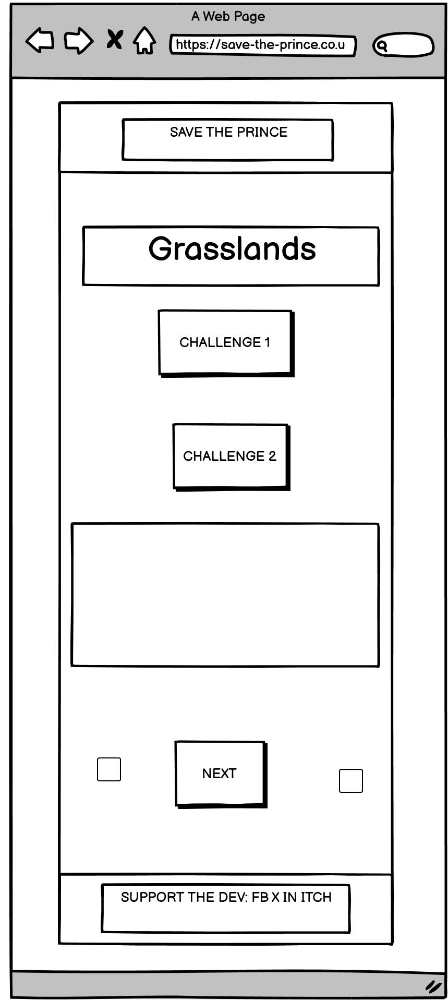
Game Areas | 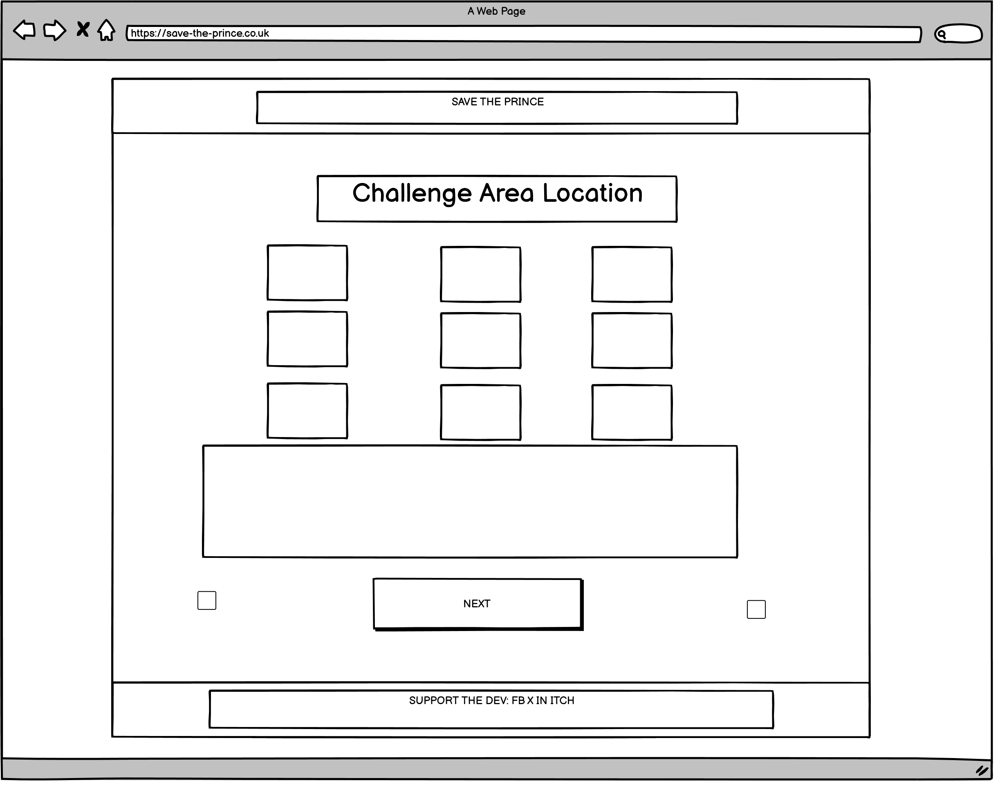 | 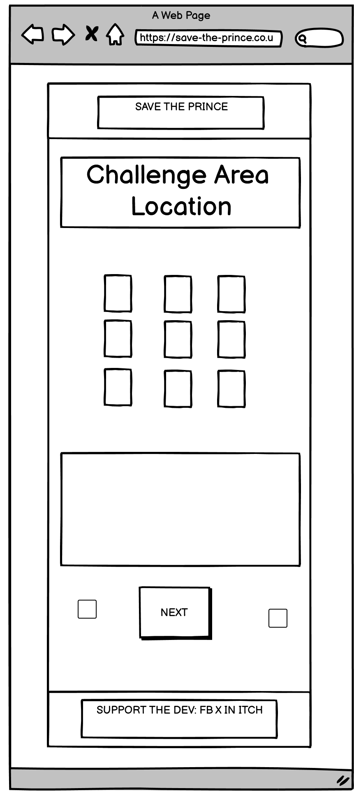
Final Page | 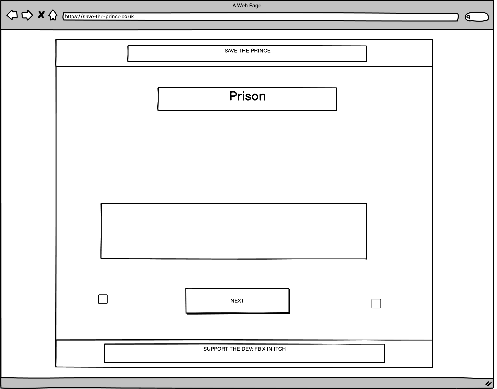 | 

[Back to top ⇧](#Save-the-Prince)

## Features

### General

### Intro Page

### Fron Page

### Loading Page

### Hub Area

### Game Areas

### Final Page

### Future Features & Pages

[Back to top ⇧](#Save-the-Prince)

### Languages

* HTML
* CSS
* JavaScript

### Frameworks & Libraries

* [Google Fonts](https://fonts.google.com/)
    - Google Fonts was used 

* [Font Awesome](https://fontawesome.com/)
     - Font Awesome loaded on all pages for icon use, 

### Other Programs

* [Visual Studio Code](https://code.visualstudio.com/)
    - This was used to write the code of the website

* [TinyPNG](https://tinypng.com/)
    - Files were compressed sing this site to ensure the lowest possible file size while still ensuring quality which helps keep the website running faster

* [Cloud Convert](https://cloudconvert.com/)
    - This was used to turn files to the WEBP format

* [GitHub](https://github.com/)
     - GitHub was used to house the code and deploy the website

* [Balsamiq](https://balsamiq.com/)
     - Wireframes created at the beginning of the project were designed on Balsamiq

* [favicon.io](https://favicon.io/)
     - This was used to create the colour palette for the website

* [Chrome DevTools](https://developer.chrome.com/docs/devtools/)
    - Throughout the building of the website, Chrome DevTools was used to solve any problems I had with my HTML or CSS

* [W3C Markup Validator](https://validator.w3.org/)
    - To test the HTML code, this was used

* [W3C CSS Validator](https://jigsaw.w3.org/css-validator/)
    - To test the CSS code, this was used

[Back to top ⇧](#Save-the-Prince)

## Testing

### Code Validation

* **JavaScript**

* **HTML**

* **CSS**

### User Story Testing

### Common Elements Testing

### Lighthouse Testing

### Browser & Device Testing

[Back to top ⇧](#Save-the-Prince)

## Final Website

[Back to top ⇧](#Save-the-Prince)

## Deployment

This project was developed using the VisualStudio Code IDE, committed to git and pushed to GitHub using the in-built function within the IDE

To deploy this page to GitHub Pages from it's [GitHub Repository](https://github.com/Greggy1234/Save-the-Prince), the following steps were taken:
1. Log into GitHub
2. From the list of repositories, select **Save-the-Prince**
3. Open settings from the menu options available
4. Select **Page** under the **Code and automation** option on the right-side menu
5. Select **Master Branch**, after which the site is automatically deployed
6. Find the link either within the pages section of settings, or on the **Code** section of the repository on the right-side options.

### How to run this project locally
To clone this project from GitHub to make further changes:
1. Go to the [GitHub Repository](https://github.com/Greggy1234/Save-the-Prince)
2. Click the green **Code** button
3. Copy the HTTPS URL on the dropdown
4. Open your local IDE and select Git Bash
5. Navigate to the directory you want the project to be clones in (**must be an empty folder**)
6. Type `git clone` followed by the URL copied in step 3 and press enter

[Back to top ⇧](#Save-the-Prince)

## Development Lifecycle

[Back to top ⇧](#Save-the-Prince)

## Credits

### Content

- All content was written by the developer

### Media

### Code