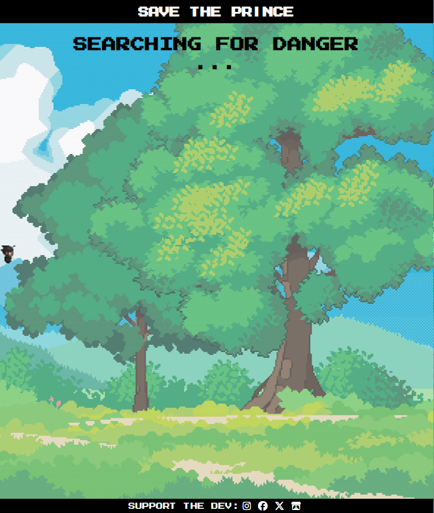
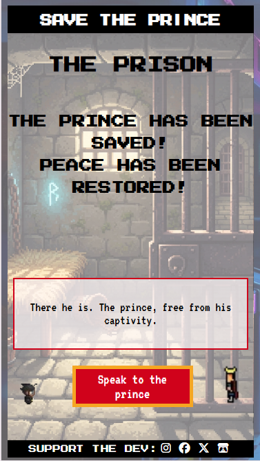

# Save-the-Prince

Save the Prince is pixel game that takes inspiration from the eraly era of video games using pixelated grpahics, tongue-in-cheek dialogue and simple game design that all together gives the user a hit of nostalgia of when games were simpler while also not being particularly mechanically complex.

The game is set out with a classic 'Start Game' screen much like you see on an arcade, with a very simple story and the only player input being naming the knight who goes on this mini adventure. It utilises loading screens to add to the game feel and create a sense of journey for the knight as they explore. The hub of the game, the Grasslands, acts as choice for players to play either of the two games and add an explanation of what the knight is doing. From the hub, they can choose Challenge 1 or Challenge 2. Challenge 1 is set in a minotaur's lava domain and is a memory challenge where the player has to copy the patern, and the JavaScript code acts as a random number generator to give the player new paterns each time they play this game. Challenge 2 is set in the necromancer's castle, and requires the player to guess the connections between words. While the connections are set, the order they appear and where the words appear are set to random to give the player a unique experience each time. Each game gives a key, and once the player has both keys, they can go to the prison area and save the prince. This the final screen where you win the game and have the option of completely resetting the game and replaying it.

Visit the deployed website [here](https://greggy1234.github.io/Save-the-Prince/)

## Table of Contents

1. [UX & Design](#ux--design)
   1. [Website Objectives](#website-objectives)
   2. [User Stories](#user-stories)
   3. [Typography](#typography)
   4. [Colour Scheme](#colour-scheme)
   5. [Wireframes](#wireframes)
2. [Features](#features)
   1. [General](#general)
   2. [Intro Page](#intro-page)
   3. [Front Page](#front-page)
   4. [Loading Page](#loading-page)
   5. [Hub Area](#hub-area)
   6. [Game Areas](#game-areas)
   7. [Final Page](#final-page)
   8. [Error Page](#error-page)
   9. [Future Features & Pages](#future-features--pages)
3. [Technologies Used](#technologies-used)
   1. [Languages](#languages)
   2. [Frameworks & Libraries](#frameworks--libraries)
   3. [Other Programs](#other-programs)
4. [Testing](#testing)
   1. [Automated vs Manual Testing](#automated-vs-manual-testing)
   2. [Code Validation](#code-validation)
   3. [User Story Testing](#user-story-testing)
   4. [Common Element Testing](#common-elements-testing)
   5. [Lighthouse Testing](#lighthouse-testing)
   6. [Browser & Device Testing](#browser--device-testing)
5. [Final Website](#final-website)
6. [Deployment](#deployment)
7. [Development Lifecycle](#development-lifecycle)
8. [Credits](#credits)
   1. [Content](#content)
   2. [Media](#media)
   3. [Code](#code)

---

## UX & Design

### Website Objectives

- Create a game that is fun to experience, especially with the tongue-in-cheek dialogue

- Create a game that is easy to pick up so anyone can play it complete it one sitting

- Create an experience that throws back to older pixel games to build a sense of nostalgia

### User Stories

- As a user, I want to play an easy to pick up game

- As a user, I want to play an old-school, pixel game

- As a user, I want to play a game that is easy to pick up

- As a user, I want to be able to support the developer of the game

### Typography

The header and footer font, which is poresent int he balck bars above and below the viewing area, is a custom font called [Megamax Jonathan Too](https://www.fontspace.com/megamax-jonathan-too-font-f124011). It's font that is based of off old MegaMan games for the NES which suits the pixel style of this game.

The header font used throughout the game in the viewing area is Press Start 2P, which is a very pixelated and strong font, almost matching the Megamax Jonathan Too font, and helps with the blockiness needed for a pixel game.

The paragraph font, used everyhwere else, is VT323, which is slightly more readable than the previous fonts, making it suitable for long text batches, but still has a pixelated feel, adding to the essence of the game.

### Colour Scheme

The main look and feel of this game comes from the 16-bit style imagery in the background, which changes based on where the knight is located. This means that the colour palette for this game is used sparingly.

But the buttons and the flashing text colours are based on the strong block colours of older games. Along with the base white (#FFFFFF) and black (#000000) colours, the red used was #D0021B, the blue used was #4A90E2 and the yellow used was #f5A623.

### Wireframes

[Balsamiq](https://balsamiq.com/) was the app used to create the wireframes. As the game is heavily based on JavaScript changing the DOM, these are basic layouts which get more complex due to the code behind them.

As it is a game with a fixed viewing are for screen size tablet and above, the desktop/tablet layout are the exact same, so they will be grouped together in the table below.

| Page         | Desktop/Tablet Version                                                                      | Mobile Version                                                                  |
| ------------ | ------------------------------------------------------------------------------------------- | ------------------------------------------------------------------------------- |
| Intro Page   |      |      |
| Front Page   |      |      |
| Loading Page |  |  |
| Hub Area     |          |          |
| Game Areas   |       |       |
| Final Area   |      |      |

[Back to top ⇧](#Save-the-Prince)

## Features

### General

- Responsive design is applied throughout the website, so all the information is displayed correctly no matter the screen size or device type, and the entire game can be played without any modification on any device

- The 16-bit style and typography remain consistent across all pages so the website feels unified

**Buttons**

- This button style is the only button style used. It shows when a mouse is hovering over it and responds by changing to blue in the centre to notify the user that they have clicked a button.

- The style is reminiscent of the almost gaudy design of early games.

**Header**
 

- An incredibly simple header that is present throughout the game, much like an arcade game machine has the title of the game at the top.

**Footer**
 

- Again, very simple with link to support the developer of the game. the icons change to red when hovered over and to blue when clicked to show that the icons have been interacted with.

- An itch.io logo is used in addition to the more popular general soical media sites as this site specialises in indie games.

**Text Area**
 

- A basic text box that is used for all speech patterns and general info throughout the game, adhering to the conventions of older video games to keep the text in a specific area and adding tot he nostalgia of the very static placement of this type of text. Used in the hub area, game areas and final area.

**Hero Sprite**
 

- This sprite is the hero of the game, and is present throughout to give the player a sense of identity and give a visual representation of the hero to the story. It is present on the loading pages, hub area, game areas and final area.

**Area Titles**
 

- Most areas, excluding the Intro page, Front page and Loading page, have a title at the top of the page to guide the player into understanding what area they should be to help immersion.

### Intro Page

**Flashing Logo**
  

- A very blocky title which dominates the screen in a pixel style that also flashes in the main colours, giving a very obvious and clear demonstration that this will be a old-school game

### Front Page

**Character Name Entry**
 

- A basic character name entry that adds some personalisation to the user. This is maxed out at 8 characters as a callback to older games where a user couldn't input large names.

### Loading Page

**Flashing Text & Increasing Dots**
 

- The text changes depending on where the character is going adding to teh immersion of the game, and the dots increase in quantity to give the effect of a page actually loading, even though there is no need to load.

**Moving Character**
 

- The hero moves across the screen to represent the feeling of travelling and a journey to the next destination.

### Hub Area

**NPC Sprite**
 

- This faceless plain looking sprite is used to build up a sense of characer in the world adn make it seem like there are otehr inhabitants, along with used as a vehicle for progressing the story of the game.

**Challenge Room Buttons**
 

- This gives the player choice for what they want to do first in the app. Much like the room choices in MegaMan games.

### Game Areas

**Monster Sprites**

| Game 1                                                        | Game 2                                                        |
| ------------------------------------------------------------- | ------------------------------------------------------------- |
|  |  |

- These are the monster sprites which adds character to the game, adds flavour to the games, and a little bit of humour (hopefully). Ther also undergoe defeat animations when the game is complete.

**Game Tile Area**

| Game 1                                                        | Game 2                                                                                                                                                       |
| ------------------------------------------------------------- | ------------------------------------------------------------------------------------------------------------------------------------------------------------ |
|  |     |

- Both games are played on a 3x3 grid to keep a sense of familiarity betwen them, and the simple structure is also reminiscient of past games.

### Final Page

**Prince Sprite**
 

- This is the sprite used for the prince as a representation of the character to save. If you want to restart the game using the action button when the choice apperas, he tries to stop you, adding to the tongue-in-cheek feeling of the game.

**Celebration Tiles**
 

- These are used to commerate you beating the game, and the underwhelming feeling of the completion which is on purpose as it adds to the silliness of the whole game which older games exhibited.

### Error Page

**Flashing Error Message**
 

- This replicates the flashing logo of the intro screen, and keeps the old school feel of the game and gives the player an obvious indication that they shouldn't be on the page.

**Automatic JavaScript Redirect**
 

- This code isused on the error page so if a user arrives at a page they shouldn't be at, they will automatically beredirected back to the main page of the game after the page has loaded and at least 2seconds have passed. There is also a button present in case the JavaScript breaks so there is no chance a userwon;t be able to return

### Future Features & Pages

[Back to top ⇧](#Save-the-Prince)

### Languages

- HTML
- CSS
- JavaScript

### Frameworks & Libraries

- [Google Fonts](https://fonts.google.com/)

  - Google Fonts was used

- [Font Awesome](https://fontawesome.com/)
  - Font Awesome loaded on all pages for icon use,

### Other Programs

- [Visual Studio Code](https://code.visualstudio.com/)

  - This was used to write the code of the website

- [TinyPNG](https://tinypng.com/)

  - Files were compressed sing this site to ensure the lowest possible file size while still ensuring quality which helps keep the website running faster

- [Cloud Convert](https://cloudconvert.com/)

  - This was used to turn files to the WEBP format

- [Sprite Sheet Extractor](https://spritesheet-extractor.vercel.app/)

  -This extracted the sprites used for the game from their respective style sheets

- [GitHub](https://github.com/)

  - GitHub was used to house the code and deploy the website

- [Balsamiq](https://balsamiq.com/)

  - Wireframes created at the beginning of the project were designed on Balsamiq

- [Coolors](https://coolors.co/)

  - This was used to create the colour palette for the website

- [Chrome DevTools](https://developer.chrome.com/docs/devtools/)

  - Throughout the building of the website, Chrome DevTools was used to solve any problems I had with my HTML or CSS

- [JSHint](https://jshint.com/)

  - To test the JaaScript code, this was used

- [W3C Markup Validator](https://validator.w3.org/)

  - To test the HTML code, this was used

- [W3C CSS Validator](https://jigsaw.w3.org/css-validator/)
  - To test the CSS code, this was used

[Back to top ⇧](#Save-the-Prince)

## Testing

### Automated vs Manual Testing

**Manual Testing**

Maunal testing is testing humans do where they maunally go through an application to test the various aspects of it. It allows for a flexible approach to testing that can be quickly adapted to the specific apps needs through more in depth testing of certain functions that were not thought of before, and is essential for testing the visual aspects of an app as a machine cannot pick up on those things. Drawbacks include the fact that humans are carrying it out, so more complex testing requires more knowledgable people which can be hard to find, mistakes can be missed and it takes a lot of time, exponentially getting longer as a project increases in size.

| Benefits                                                                                                                                                                                                                                                                                             | Drawbacks                                                                                                                                                                                                                              |
| ---------------------------------------------------------------------------------------------------------------------------------------------------------------------------------------------------------------------------------------------------------------------------------------------------- | -------------------------------------------------------------------------------------------------------------------------------------------------------------------------------------------------------------------------------------- |
| - Flexible in what is tested and the method of how its done - Adaptable to sudden changes in the app - Instant feedback on shorter projects without requiring building automated processes - Can also test for UI and UX issues - Flexible and adaptable - Cheaper to begin with | - Higher chance of missing bugs due to human error - For longer projects, it takes longer to carry out testing - Hard to find those who are knowledgable enough to carry out every test - Less precise in in replicability |

Maunal testing should be used for in the moment testing of newly made functions, shorter projects, testing for UI, UX and visual designs, and exploratory testing.

**Automated Testing**

Testing where tools are used to perform test is called automated testing, where the tests themselves are all pre-scripted, allowing for a large amount of easily replicated tests to made continously throughout development, saving significant time on larger scale projects. If the tests are made correctly, they can find more bugs without the need for pause like a human. However, it requires a whole new skillset to write, maintain and create these tests which puts a barrier up, along with expensive testing automation software, and they cannot help with finding bugs in the visual elements of the app

| Benefits                                                                                                                                                                                                                                                                                                                | Drawbacks                                                                                                                                                                                                                                                                                                                               |
| ----------------------------------------------------------------------------------------------------------------------------------------------------------------------------------------------------------------------------------------------------------------------------------------------------------------------- | --------------------------------------------------------------------------------------------------------------------------------------------------------------------------------------------------------------------------------------------------------------------------------------------------------------------------------------- |
| - Tests run quickly and can be repeated - No need for rest between tests - Saves money oin the long run for larger projects - Will not miss defects (if the test is written correctly) - Can instantly show errors in larger functions witout having to manually go through each line of code  | - Can't test for visual elements, UI, UX, or user journey  - Software requries a high upfront costs - A high level of skill is needed to whoever writes and mainains the code, so resources might be hard to find  - Time consuming at the beginning to write the tests so feedback on new functions can take time  |

Automated testing should be carried out when embarking on longer projects as over time the cost and time spend up front will pay off in the long run. If wasily replicated tests that need to be running constantly are needed, this is also where automated testing shines.

### Code Validation

- **JavaScript**

| Script      | Validator Confirmation                                                 |
| ----------- | ---------------------------------------------------------------------- |
| script.js   |  |
| redirect.js |  |

While the script.js file received seven warnings, they were just to note that confusing semantics can come about with referencing variables outside the scope. There were no errors in the code.

- **HTML**

| Page       | Validator Confirmation                                                    |
| ---------- | ------------------------------------------------------------------------- |
| Index Page |  |
| Error Page |  |

- **CSS**

- CSS has been checked and no errors were found

### User Story Testing

| User Story | Feature to Address User Story | Evidence |
| ---------- | ----------------------------- | -------- |

### Common Elements Testing

- General

| Feature | Outcome | Pass/Fail |
| ------- | ------- | --------- |

- Intro Page Section

| Feature | Outcome | Pass/Fail |
| ------- | ------- | --------- |

- Start Page Section

| Feature | Outcome | Pass/Fail |
| ------- | ------- | --------- |

- Loading Screen Section

| Feature | Outcome | Pass/Fail |
| ------- | ------- | --------- |

- Hub Area Section

| Feature | Outcome | Pass/Fail |
| ------- | ------- | --------- |

- Game 1 Section

| Feature | Outcome | Pass/Fail |
| ------- | ------- | --------- |

- Game 2 Section

| Feature | Outcome | Pass/Fail |
| ------- | ------- | --------- |

- Final Area Section

| Feature | Outcome | Pass/Fail |
| ------- | ------- | --------- |

- Error Page

| Feature | Outcome | Pass/Fail |
| ------- | ------- | --------- |

### Lighthouse Testing

- Lighthouse testing was used to review performance and accessibility of the pages

| Page       | Lighthouse Result                                                                 |
| ---------- | --------------------------------------------------------------------------------- |
| Index Page |  |
| Error Page |    |

### Browser & Device Testing

**Browser Testing**

| Browser         | Outcome | Pass/Fail |
| --------------- | ------- | --------- |
| Google Chrome   | X       | X         |
| Safari          | X       | X         |
| Mozilla Firefox | X       | X         |
| Microsoft Edge  | X       | X         |

**Device Testing**

| Device                   | Outcome | Pass/Fail |
| ------------------------ | ------- | --------- |
| iPhone SE                | X       | X         |
| iPhone XR                | X       | X         |
| iPhone 12 Pro            | X       | X         |
| iPhone 14 Pro Max        | X       | X         |
| Samsung Galaxy S20 Ultra | X       | X         |
| iPad Pro                 | X       | X         |
| Surface Pro 7            | X       | X         |
| HP Laptop                | X       | X         |

[Back to top ⇧](#Save-the-Prince)

## Final Website

| Page         | Desktop Layout                                                                | Mobile Layout                                                  |
| ------------ | ----------------------------------------------------------------------------- | -------------------------------------------------------------- |
| Intro Page   |      |      |
| Front Page   |      |      |
| Loading Page |  |  |
| Hub Area     |          |          |
| Game 1 Area  |    |    |
| Game 2 Area  |    |    |
| Final Area   |      |      |
| Error Page   |      |      |

[Back to top ⇧](#Save-the-Prince)

## Deployment

This project was developed using the VisualStudio Code IDE, committed to git and pushed to GitHub using the in-built function within the IDE

To deploy this page to GitHub Pages from it's [GitHub Repository](https://github.com/Greggy1234/Save-the-Prince), the following steps were taken:

1. Log into GitHub
2. From the list of repositories, select **Save-the-Prince**
3. Open settings from the menu options available
4. Select **Page** under the **Code and automation** option on the right-side menu
5. Select **Master Branch**, after which the site is automatically deployed
6. Find the link either within the pages section of settings, or on the **Code** section of the repository on the right-side options.

### How to run this project locally

To clone this project from GitHub to make further changes:

1. Go to the [GitHub Repository](https://github.com/Greggy1234/Save-the-Prince)
2. Click the green **Code** button
3. Copy the HTTPS URL on the dropdown
4. Open your local IDE and select Git Bash
5. Navigate to the directory you want the project to be clones in (**must be an empty folder**)
6. Type `git clone` followed by the URL copied in step 3 and press enter

[Back to top ⇧](#Save-the-Prince)

## Development Lifecycle

[Back to top ⇧](#Save-the-Prince)

## Credits

### Content

- All content was written by the developer

### Media

| Page                                                       | File Name                                                                                                                                                                                                                                                                                                                                                                                | Credit Link                                                                                      |
| ---------------------------------------------------------- | ---------------------------------------------------------------------------------------------------------------------------------------------------------------------------------------------------------------------------------------------------------------------------------------------------------------------------------------------------------------------------------------- | ------------------------------------------------------------------------------------------------ |
| Background to Screen                                       | background-behind-viewing-area                                                                                                                                                                                                                                                                                                                                                           | [Stock Cake](https://stockcake.com/i/arcade-neon-glow_142304_17948)                              |
| Intro Page/Error Screen                                    | background-intro-screen                                                                                                                                                                                                                                                                                                                                                                  | Created using Google Gemini                                                                      |
| Front Page                                                 | background-front-page                                                                                                                                                                                                                                                                                                                                                                    | Created using Google Gemini                                                                      |
| Loading Screen/Hub Area/Game 1 Area/Game 2 Area/Final Area | sprite-hero-still-left sprite-hero-still-right sprite-hero-walk-left sprite-hero-walk-right                                                                                                                                                                                                                                                                               | [itch.io](https://elvgames.itch.io/cellar-tileset-16x16-pixelart)                                |
| Loading Screen                                             | background-loading-page-1 background-loading-page-2 background-loading-page-3 background-loading-page-4                                                                                                                                                                                                                                                                   | [itch.io](https://free-game-assets.itch.io/nature-landscapes-free-pixel-art)                     |
| Hub Area                                                   | background-hub-area                                                                                                                                                                                                                                                                                                                                                                      | [Freepik](https://www.freepik.com/free-vector/pixel-art-rural-landscape-background_49685500.htm) |
| Hub Area                                                   | sprite-npc                                                                                                                                                                                                                                                                                                                                                                               | [itch.io](https://admurin.itch.io/free-monster-pack-character)                                   |
| Game 1 Area                                                | background-game-one-area                                                                                                                                                                                                                                                                                                                                                                 | [Stock Cake](https://stockcake.com/i/fiery-mountain-night_3119874_1577548)                       |
| Game 1 Area                                                | game-tile-game-one-lava                                                                                                                                                                                                                                                                                                                                                                  | Created using Google Gemini                                                                      |
| Game 1 Area                                                | sprite-game-one-enemy-pose-1 sprite-game-one-enemy-pose-2 sprite-game-one-enemy-pose-3 sprite-game-one-enemy-death-1 sprite-game-one-enemy-death-2 sprite-game-one-enemy-death-3 sprite-game-one-enemy-death-4 sprite-game-one-enemy-death-5 sprite-game-one-enemy-death-6                                                                       | [itch.io](https://elthen.itch.io/2d-pixel-art-minotaur-sprites)                                  |
| Game 2 Area                                                | background-game-two-area                                                                                                                                                                                                                                                                                                                                                                 | [itch.io](https://free-game-assets.itch.io/free-castle-interior-pixel-game-backgrounds)          |
| Game 2 Area                                                | game-tile-game-two-broken game-tile-game-two-fixed                                                                                                                                                                                                                                                                                                                                  | Created using Google Gemini                                                                      |
| Game 2 Area                                                | sprite-game-two-enemy-pose-1 sprite-game-two-enemy-pose-2 sprite-game-two-enemy-pose-3 sprite-game-two-enemy-death-1 sprite-game-two-enemy-death-2 sprite-game-two-enemy-death-3 sprite-game-two-enemy-death-4 sprite-game-two-enemy-death-5 sprite-game-two-enemy-death-6 sprite-game-two-enemy-death-7 sprite-game-two-enemy-death-8 | [itch.io](https://oco.itch.io/medieval-fantasy-character-pack-6)                                 |
| Final Area                                                 | background-final-area                                                                                                                                                                                                                                                                                                                                                                    | Created using Google Gemini                                                                      |
| Final Area                                                 | sprite-prince                                                                                                                                                                                                                                                                                                                                                                            | [itch.io](https://chasersgaming.itch.io/rpg-asset-character-king-sms)                            |
| Final Area                                                 | game-tile-final-area-confetti                                                                                                                                                                                                                                                                                                                                                            | Created using Google Gemini                                                                      |

### Code

- The FIsher Yates method of shuffling was used for Game 2, and it was taken from [W3Schools](https://www.w3schools.com/js/js_array_sort.asp)

- [Stack Overflow](https://stackoverflow.com/) and [W3Schools](https://www.w3schools.com/) were consulted throughout the project to check the code was correctly implemented
